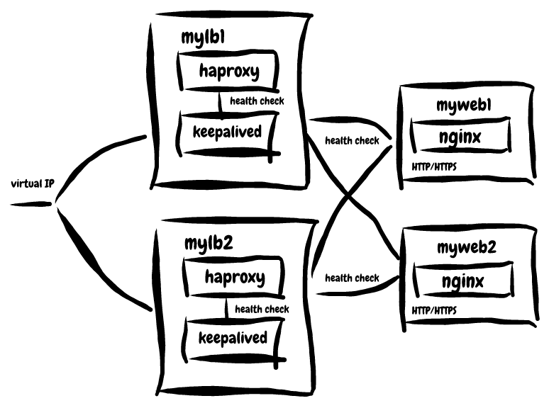

## MorningSpace Lab

晴耕实验室

[](https://morningspace.github.io)

# A Taste of Load Balancing

Keywords: HAProxy, Keepalived, Docker, SSL, nginx, Load Balance

## Overview

This is the lab project to demonstrate how to set up highly available load balancing service using HAProxy and Keepalived.

This lab project is entirely based on Docker technology. You can play it in a sandbox at your local, which is composed by a few Docker containers.

As the figure depicted below, there are two web servers, `myweb1` and `myweb2`, which are the containers built from the image `morningspace/lab-web`. It uses nginx serving as web server. Both HTTP and HTTPS are enabled.

In front of the web servers, there are two load balancers, `mylb1` and `mhylb2`, which are the containers built from the image `morningspace/lab-lb`. Both haproxy and keepalived are installed. The haproxy connects to the two web servers, while keepalived is to check whether haproxy is available or not. We define `mylb` as master node, and `mylb2` as backup node to support haproxy failover. It also exposes a virutal IP that can be accessed by client.



Please check the below instructions to learn how to play with it.

You can also find the online slides [here](https://morningspace.github.io/lab-load-balancing/slides).

For more lab projects from MorningSpace Lab, please check [morningspace.github.io](https://morningspace.github.io).

## Instructions

### Build or Pull Docker Images

Go to the project root directory, and build docker images for both web server and load balancer:
```shell
docker build -f docker/web/Dockerfile -t morningspace/lab-web .
docker build -f docker/lb/Dockerfile -t morningspace/lab-lb .
```

The docker images have also been pushed to Docker Hub. So, you can pull them from there too.
```
docker pull morningspace/lab-lb
docker pull morningspace/lab-web
```

### Launch Web Servers

Launch two docker containers for the image `morningspace/lab-web` as web servers:
```
docker run -d --name myweb1 --hostname myweb1 --net=lab -p 18080:80 -p 18443:443 morningspace/lab-web
docker run -d --name myweb2 --hostname myweb2 --net=lab -p 19080:80 -p 19443:443 morningspace/lab-web
```

Note:
* Make sure the network `lab` has been created beforehand by running below command:
```
docker network create lab
```

Run `docker ps` to verify the docker containers are launched successfully.

Input below URLs in browser to verify it returns expected messages:
```
http://localhost:18080/healthz
http://localhost:19080/healthz
https://localhost:18443/healthz
https://localhost:19443/healthz
```
The returned message looks like `Greeting from <hostname>`, where the `hostname` is the value specified by `--hostname` option when launch the docker container.

### Launch Load Balancers

Launch two docker containers for the image `morningspace/lab-lb` as load balancers:
```
docker run -it --name mylb1 --hostname mylb1 --net=lab -p 28080:8080 -p 28443:8443 -p 28090:8090 --sysctl net.ipv4.ip_nonlocal_bind=1 --privileged morningspace/lab-lb
docker run -it --name mylb2 --hostname mylb2 --net=lab -p 29080:8080 -p 29443:8443 -p 29090:8090 --sysctl net.ipv4.ip_nonlocal_bind=1 --privileged morningspace/lab-lb
```

Run `docker ps` to verify the docker containers are launched successfully.

### Configure and Run HAProxy

After the load balancer container is launched, it will take you into the container. Make sure haproxy has not been started:
```
service haproxy status
```
It should return something as below:
```
haproxy not running
```

Go to the directory `/etc/haproxy`, where there are sample configuration files for haproxy. Copy one of them to replace `haproxy.cfg`, e.g.
```
cp haproxy-ssl-termination.conf haproxy.cfg
```

Start haproxy as a service:
```
service haproxy start
```

Verify haproxy started successfully by monitoring logs:
```
tail -f /var/log/haproxy.log
```

Input below URLs in browser to open the haproxy statistics report view:
```
http://localhost:28090/haproxy/stats
http://localhost:29090/haproxy/stats
```
Input the predefined username and password, haproxy/passw0rd, when promted.

Repeat the same steps in the other load balancer container.

Note:
* If you forget which load balancer container you are in, type `hostname` in the container.
* If you exit the container for some reason, the container will be stopped as expected. To go back, e.g. `mylb1`, run below command:
```
docker start -i mylb1
```

### Configure and Run Keepalived 

Go to the directory `/etc/keepalived`, where there are two sample configuration files for keepalived. One is for master node, and the other one is for backup node.

Run `ping` command to get all the IP addresses for the containers involved in the current network, then use a new IP address as the virtual IP address that does not conflict with others, e.g.:

Node		| IP Address
-------	| -------------
myweb1	| 172.18.0.2
myweb2	| 172.18.0.3
mylb1		| 172.18.0.4
mylb2		| 172.18.0.5
virtual*| 172.18.0.6

Here we use 172.18.0.6 as the virtual IP address. Replace `<your_virtual_ip>` with the actual value in both `keepalived-master.conf` and `keepalived-backup.conf`.

Note:
* The value of `interface` defined in sample configuration files is `eth0`. It could be different depending on your system. To figure out the right value, you can run `ip addr show`.

Choose one load balancer container as master, e.g. `mylb1`. Launch keepalived on master using master configuration:
```
keepalived --dump-conf --log-console --log-detail --log-facility 7 --vrrp -f /etc/keepalived/keepalived-master.conf
```

In backup container, launch keepalived using backup configuration:
```
keepalived --dump-conf --log-console --log-detail --log-facility 7 --vrrp -f /etc/keepalived/keepalived-backup.conf
```

Verify keepalived started successfully by monitoring logs:
```
tail -f /var/log/syslog
```

Verify the virtual IP address is assigned successfully, run below command on master:
```
ip addr show eth0
```
If configured correctly, you will see the virtual IP address appeared in the output.

Run `curl` in either of the two load balancer containers. Send request to the virutal IP and see if it returns the content retrieved from web servers, e.g. in the case where ssl is not enabled:
```
curl -XGET http://<virtual_ip>:8080/healthz
```
And ssl is enabled:
```
curl --insecure --cert /etc/ssl/certs/my.crt --key /etc/ssl/private/my.key -XGET https://<virtual_ip>:8443/healthz
```

## Test

### Web Server

Try to stop one of the web servers, e.g.:
```
docker stop myweb1
```

Wait for a moment then check the haproxy statistics report in browser, e.g. use the below URL, to see if `myweb1` is down:
```
http://localhost:28090/haproxy/stats
```

Hit the `/healthz` endpoint exposed by load balancer either in browser or using `curl`. Make sure `myweb1` will never be hit.

Start `myweb1` again:
```
docker start myweb1
```

Wait for a moment then check the haproxy statistics report in browser to see if `myweb1` is up.

Hit the `/healthz` endpoint again. Make sure both `myweb1` and `myweb2` will be hit.

### Load balancer

Try to stop the master haproxy service within the container, e.g. `mylb1`.
```
service haproxy stop
```

Wait for a moment then check the keepalived logs by monitoring `/var/log/syslog` in both load balancer containers. See if `mylb1` entered into `BACKUP` state, and `mylb2` transitioned to `MASTER` state.

You can also verify it using `ip` command in both containers:
```
ip addr show eth0
```
If it works correctly, you will see the virtual IP address appeared in the output in container `mylb2` instead of container `mylb1`.

Run `curl` in either of the two load balancer containers. Send request to the virutal IP and see if it still returns the content retrieved from web servers.

Start `mylb1` again:
```
service haproxy start
```

Wait for a moment then check the keepalived logs. See if `mylb1` gained `MASTER` state, and `mylb2` returned back to `BACKUP` state.

You can also verify it using `ip` command in both containers, to see if the virtual IP address appeared in the output in container `mylb1` instead of container `mylb2`.

Run `curl` in either of the two load balancer containers. Send request to the virutal IP and see if it still returns the content retrieved from web servers.

## Troubleshooting

* Add `tune.ssl.default-dh-param 2048` if met "[WARNING] 277/024013 (214) : Setting tune.ssl.default-dh-param to 1024 by default, if your workload permits it you should set it to at least 2048. Please set a value >= 1024 to make this warning disappear."

* Run `service rsyslog restart` if met "[ALERT] 277/004806 (177) : sendmsg logger #1 failed: No such file or directory (errno=2)"
